[//]: <> (This is a comment and is not visible in the presentation)
[//]: <> (make cmd: pandoc presentaion.md -t beamer -o presentaion.pdf)

# What We Wanted to Achieve

## Inspiration

https://thispersondoesnotexist.com/

# What Was Needed

::: incremental

* Create a model that would generate images of dinosaurs
    * "State-of-the-art"
    * Explore and compare different models
* Use of the school's HPC cluster for training on graphics cards
* Creation of a web application

:::

# Data Collection

To create training data, we used https://www.kaggle.com/. Specifically:

* https://www.kaggle.com/datasets/larserikrisholm/dinosaur-image-dataset-15-species – 2448 images - 510MB
* https://www.kaggle.com/datasets/cmglonly/simple-dinosurus-dataset - 200 images - 58MB
* https://www.kaggle.com/datasets/antaresl/jurassic-park-dinosaurs-dataset - 4364 images - 4GB 
* https://www.kaggle.com/datasets/caokhoihuynh/jurassic-world-dinosaur - 5835 images - 1.6GB

# Pre-processing

* Images are rescaled to 256x256 px
* Given the size of the dataset (12848 images total), we decided not to include any augmentation techniques

# Model Selection

## Stable Diffusion

* Iterative noise removal
* Too computationally demanding for our use

## DC-GAN

* The model has two parts: Generator and discriminator
* Too difficult a task, the discriminator always achieves 100% accuracy

## VAE

* Encoder -> Latent space -> Decoder
* Computationally undemanding

# Training

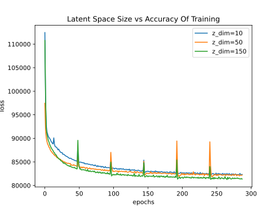{ width=11cm } 

# Results 

- 48 epochs

| 150 | 50 | 10 | 5 | 2 |
|--|--|--|--|--|
| 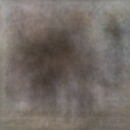 | 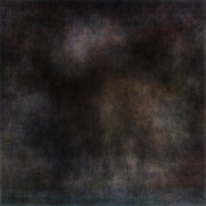 | 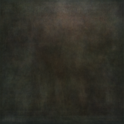 | 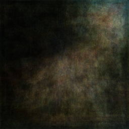 | 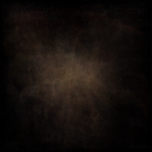 |
| 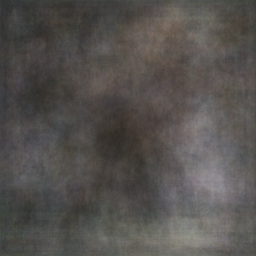 | 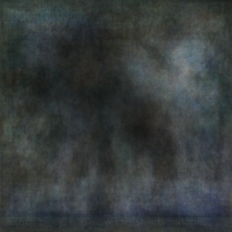 | 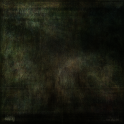 | 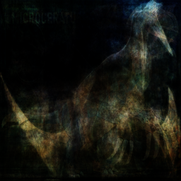 | 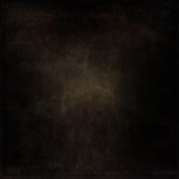 |
| 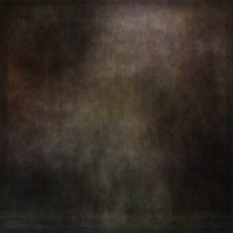 | 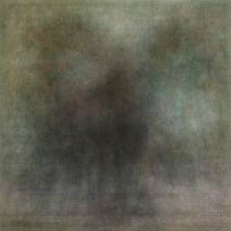 | 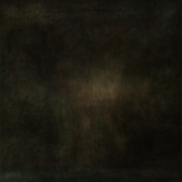 | 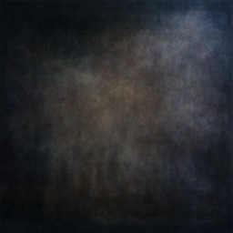 | 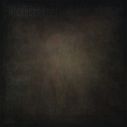 |

# Results 

- 96 epochs

| 150 | 50 | 10 | 5 | 2 |
|--|--|--|--|--|
| 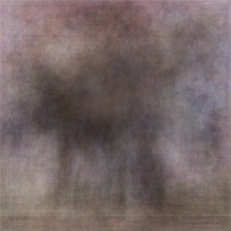 | 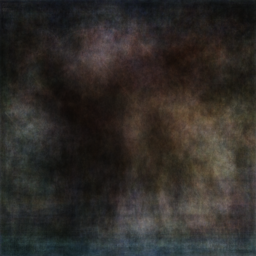 | 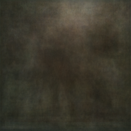 | 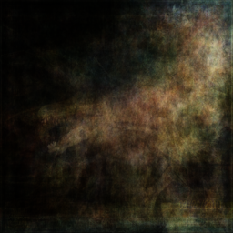 | 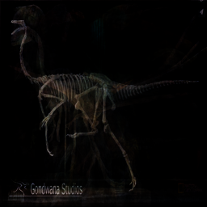 |
| 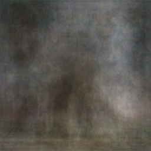 | 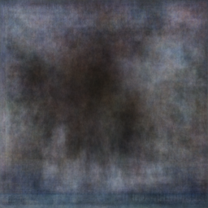 | 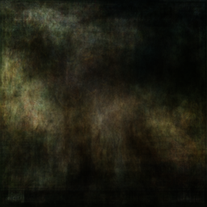 | 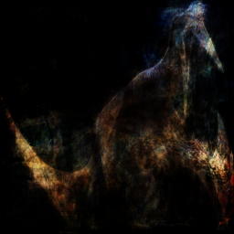 | 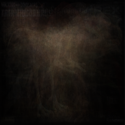 |
| 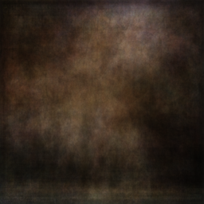 | 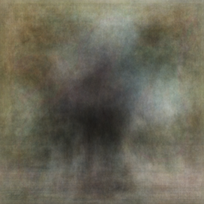 | 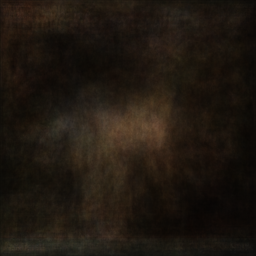 | 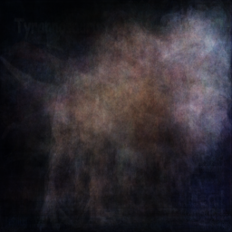 | 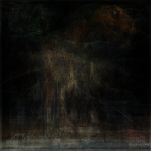 |

# Results 

- 144 epochs

| 150 | 50 | 10 | 5 | 2 |
|--|--|--|--|--|
| 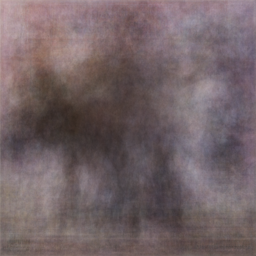 | 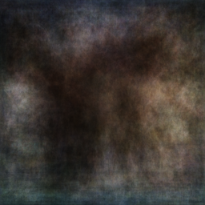 | 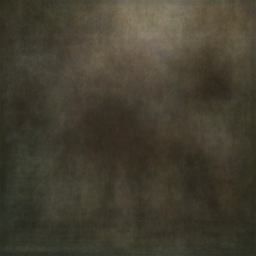 | 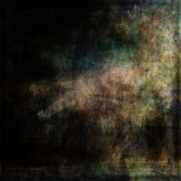 | 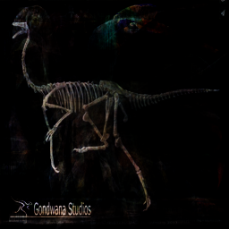 |
| 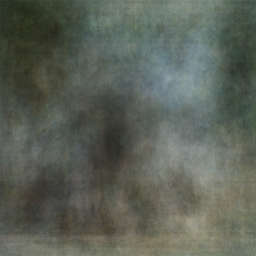 | 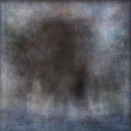 | 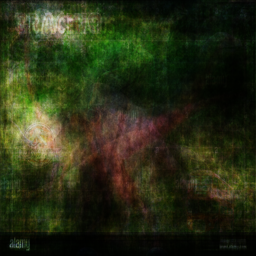 | 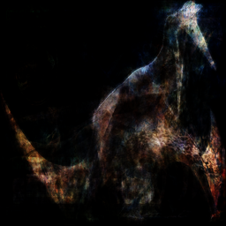 | 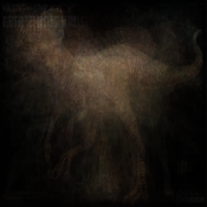 |
| 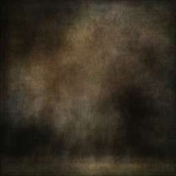 | 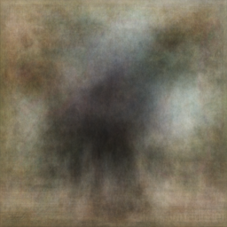 | 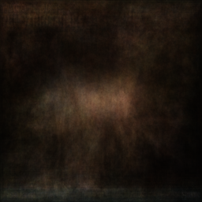 | 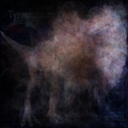 | 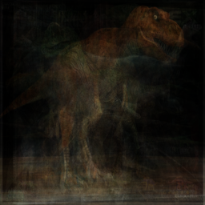 |

# Results 

- 192 epochs

| 150 | 50 | 10 | 5 (144 ep.) | 2 |
|--|--|--|--|--|
| 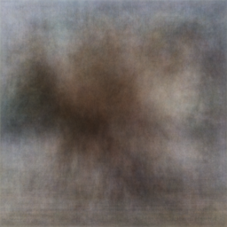 | 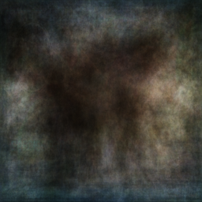 | 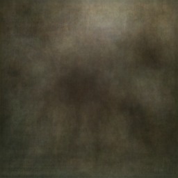 |  | 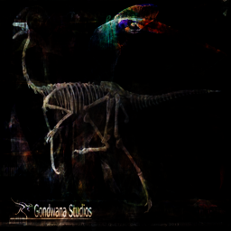 |
|  |  |  |  |  |
|  |  |  |  |  |

# Results 

- 240 epochs

| 150 | 50 | 10 | 5 (144 ep.) | 2 |
|--|--|--|--|--|
|  |  |  |  |  |
|  |  |  |  |  |
|  |  |  |  |  |

# Results 

- 288 epochs

| 150 | 50 | 10 | 5 (144 ep.) | 2 (240 ep.) |
|--|--|--|--|--|
|  |  |  |  |  |
|  |  |  |  |  |
|  |  |  |  |  |

# Results

{ height=8cm }

# Discussion

::: incremental

* The models trained properly, but did not have sufficient capacity
* Models with large latent space were a dead end

:::
